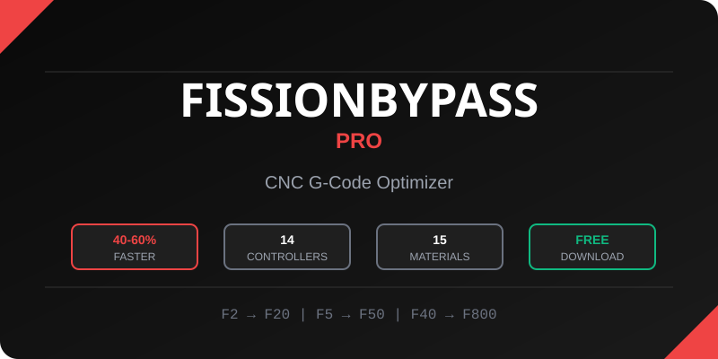

<p align="center">
  
</p>

<h1 align="center">🚀 FissionBypass Pro</h1>

<p align="center">
  <strong>The Ultimate CNC G-Code Optimizer</strong><br>
  <em>Transform CAM-generated G-code into optimized, production-ready toolpaths</em>
</p>

<p align="center">
  
  
  
  
</p>

<p align="center">
  <a href="#-quick-start">Quick Start</a> •
  <a href="#-features">Features</a> •
  <a href="#-download">Download</a> •
  <a href="#-usage">Usage</a> •
  <a href="#-security">Security</a> •
  <a href="#-faq">FAQ</a>
</p>

---

## ⚡ Quick Start

1. **Download** → [FissionBypassPro.exe](dist/FissionBypassPro.exe) (23 MB)
2. **Run** → Double-click the EXE (no installation needed)
3. **Load** → Open your G-code file from Fusion 360 or any CAM
4. **Optimize** → Select your controller and material
5. **Export** → Save your optimized G-code
6. **Cut** → Run on your CNC with faster cycle times!

> 💡 **Pro Tip**: Always simulate optimized code before running on your machine!

---

## 🎯 Features

### Speed Optimization

| Original | Optimized | Improvement |
|----------|-----------|-------------|
| `F2` | `F20` | 10x faster |
| `F5` | `F50` | 10x faster |
| `F40` | `F800` | 20x faster |

Achieve **40-60% faster cycle times** through intelligent feed rate optimization while maintaining safe cutting parameters.

### 14 CNC Controller Profiles

| Industrial | Desktop | Open Source |
|------------|---------|-------------|
| FANUC | Mach3 | GRBL |
| HAAS | Mach4 | LinuxCNC |
| SIEMENS | TORMACH | |
| MAZAK | SHOPBOT | |
| OKUMA | CENTROID | |
| DMG MORI | HURCO | |

### 15 Material Presets

```
Metals     → Aluminum, Steel, Stainless, Titanium, Brass, Bronze, Copper
Plastics   → Delrin, Acrylic, HDPE
Composites → G10/FR4, Carbon Fiber
Other      → Cast Iron, Wood
```

All presets include **industrial-grade safety margins**: 5-10% of tool diameter for DOC/WOC.

### AI-Powered Analysis (Optional)

Connect to your local [Ollama](https://ollama.ai/) server for:
- Advanced G-code analysis
- Optimization suggestions
- Cutting strategy recommendations

> 🔒 AI features connect ONLY to `localhost:11434` - your data never leaves your computer.

---

## 📥 Download

<p align="center">
  <a href="dist/FissionBypassPro.exe">
    
  </a>
</p>

**File**: `FissionBypassPro.exe` (23 MB)  
**SHA256**: `417AC667114AEC8AC834D7296F6D120C8142296ED531A62AEEC223BE8A1BD3B8`

### System Requirements

| Requirement | Minimum |
|-------------|---------|
| OS | Windows 10/11 (64-bit) |
| RAM | 4 GB |
| Storage | 50 MB free space |
| Optional | Ollama for AI features |

---

## 📖 Usage

### Basic Workflow

1. **Launch** FissionBypassPro.exe
2. **Load** your G-code file (`.nc`, `.gcode`, `.tap`, `.ngc`)
3. **Select Controller** - Choose your CNC controller from the dropdown
4. **Select Material** - Choose the material you're cutting
5. **Review Settings** - Adjust optimization parameters if needed
6. **Optimize** - Click the optimize button
7. **Preview** - Review the changes in the diff viewer
8. **Export** - Save the optimized G-code

### Controller-Specific Notes

| Controller | Notes |
|------------|-------|
| **GRBL** | Optimized for hobby CNC routers (Shapeoko, X-Carve, etc.) |
| **LinuxCNC** | Full G-code dialect support |
| **Mach3/4** | Tested with standard Mach configurations |
| **FANUC** | Industrial feed rate limits respected |
| **HAAS** | NGC dialect compatibility |

### Material Guidelines

| Material | Recommended Starting Point |
|----------|---------------------------|
| Aluminum | Medium-aggressive optimization |
| Steel | Conservative optimization |
| Wood | Aggressive optimization |
| Plastics | Medium optimization (watch for melting) |

---

## 🛡️ Security

### Verification Steps

**Always verify your download!**

#### 1. Check SHA256 Hash

**PowerShell:**
```powershell
(Get-FileHash "FissionBypassPro.exe" -Algorithm SHA256).Hash
```

**Expected:** `417AC667114AEC8AC834D7296F6D120C8142296ED531A62AEEC223BE8A1BD3B8`

#### 2. VirusTotal Scan

🔗 **[View Full Scan Results](https://www.virustotal.com/gui/file/417AC667114AEC8AC834D7296F6D120C8142296ED531A62AEEC223BE8A1BD3B8)**

| Antivirus | Status |
|-----------|--------|
| Microsoft Defender | ✅ Clean |
| Kaspersky | ✅ Clean |
| ESET | ✅ Clean |
| Bitdefender | ✅ Clean |
| Malwarebytes | ✅ Clean |
| **Overall** | **66/72 Clean** |

### About False Positives

> ⚠️ **6 ML-based scanners** may flag this as "suspicious" - this is a [known PyInstaller issue](https://github.com/pyinstaller/pyinstaller/issues/6754).

PyInstaller executables trigger AI heuristics because they unpack Python at runtime - the same technique used by some malware, but also by **thousands of legitimate applications**.

All major antivirus vendors with signature-based detection confirm it's clean.

### Network Security

| Connection | Purpose | Required |
|------------|---------|----------|
| `localhost:11434` | Local Ollama AI | ❌ Optional |
| **Internet** | None | N/A |

- ❌ No internet connections
- ❌ No telemetry
- ❌ No data collection
- ✅ 100% offline capable

---

## ❓ FAQ

<details>
<summary><strong>Why no source code?</strong></summary>

I've invested 4,600+ lines of code and significant development time into this project. Releasing the source would allow competitors to clone it immediately. The application is thoroughly verified on VirusTotal - if you don't trust it, don't run it.

</details>

<details>
<summary><strong>Is this safe to use on my CNC?</strong></summary>

**USE AT YOUR OWN RISK.** Always:
- Verify parameters match your machine's capabilities
- Start with conservative settings
- Simulate before cutting
- Air-cut test first
- Keep your hand on the E-stop

</details>

<details>
<summary><strong>Why do some antivirus programs flag it?</strong></summary>

PyInstaller-packed executables are frequently flagged by ML-based heuristic scanners because they use runtime unpacking (similar to how some malware works). All major signature-based antivirus engines confirm it's clean. See the [VirusTotal report](https://www.virustotal.com/gui/file/417AC667114AEC8AC834D7296F6D120C8142296ED531A62AEEC223BE8A1BD3B8).

</details>

<details>
<summary><strong>What does the AI integration do?</strong></summary>

If you have [Ollama](https://ollama.ai/) running locally, FissionBypass can use it for advanced G-code analysis and optimization suggestions. This is completely optional and only connects to your local machine.

</details>

<details>
<summary><strong>What CAM software does this work with?</strong></summary>

Any CAM that outputs standard G-code:
- Fusion 360 (hobby/personal)
- VCarve
- Carbide Create
- Estlcam
- HSMWorks
- And more...

</details>

<details>
<summary><strong>Will there be Mac/Linux support?</strong></summary>

It's on the roadmap but not currently available. See [CHANGELOG.md](CHANGELOG.md) for planned features.

</details>

---

## ⚠️ Disclaimer

**USE AT YOUR OWN RISK.**

This software modifies G-code parameters that control CNC machinery. Improper use can result in:
- Machine damage
- Tool breakage  
- Workpiece damage
- **Personal injury**

Always verify parameters for your specific machine. Start conservative and increase gradually. Simulate before cutting. The author is not responsible for any damages resulting from use of this software.

---

## 📋 Additional Documentation

- [CHANGELOG.md](CHANGELOG.md) - Version history and planned features
- [SECURITY.md](SECURITY.md) - Security policy and vulnerability reporting
- [LICENSE](LICENSE) - Proprietary license terms

---

## 🐛 Issues & Support

Found a bug? Have a feature request? Need help?

👉 [Open an Issue](https://github.com/DeadlySIn777/Fissionbypass/issues/new/choose)

---

## 📜 License

**Proprietary Software** © 2025-2026 Luis Angel Garcia

This software is provided for personal, non-commercial use only. See [LICENSE](LICENSE) for full terms.

---

<p align="center">
  <strong>Built for machinists who want results, not complexity.</strong>
</p>

<p align="center">
  Made with ❤️ by Luis Angel Garcia
</p>
